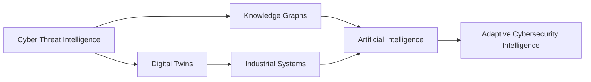

<h1 align="center">OrchiCyb</h1>

OrchiCyb is an independent cybersecurity research lab exploring how Cyber Threat Intelligence, Artificial Intelligence and Digital Twins can improve the understanding of cyber threats affecting modern organizations and critical infrastructure. The research focuses on transforming fragmented cyber data into contextual intelligence through knowledge graphs, AI-assisted reasoning and interactive visualisation. Rather than building traditional monitoring tools, OrchiCyb explores how security professionals can better understand, simulate and anticipate cyber attacks.

---

# Current Research

Current research focuses on the intersection of:

- Cyber Threat Intelligence 
- Critical Infrastructure Security
- Industrial Control Systems (ICS)
- Detection Engineering
- AI Security
- Industrial Cybersecurity
- AI-assisted Threat Analysis
- Knowledge Graph Reasoning
- MITRE ATT&CK, D3FEND, ATLAS
- Industrial Control Systems (ICS)
- Operational Technology (OT)
- Digital Twins for Cybersecurity
- Human-AI Collaboration
- Emerging Threat Landscapes

---

# Research Ecosystem

---

# Featured Research

## 🌸 OrchiCyb AI ATTACK

An AI-native Cyber Threat Intelligence platform exploring relationships between:

- Threat Actors
- Campaigns
- Malware
- MITRE ATT&CK
- MITRE D3FEND
- MITRE ATLAS
- Security Controls
- Knowledge Graphs
- AI-assisted Intelligence

➡️ https://github.com/orchicyb/OrchiCyb-AI-Attack

---

## 🌸 OrchiCyb CRITICAL TWIN

An AI-powered Cyber Threat Intelligence Digital Twin for Critical Infrastructure. The platform explores how cyber attacks propagate through industrial environments using interactive Digital Twins inspired by real-world operational technology.

Current industries include:
- Water Treatment
- Electric Grid
- Railway
- Airport
- Port Terminal
- Oil & Gas
- Manufacturing
- Chemical Plant

Research topics include:
- MITRE ATT&CK for ICS
- Purdue Model
- Attack Simulation
- Physical Impact Visualisation
- AI-assisted Incident Analysis
- Operational Consequence Modelling

➡️ https://github.com/orchicyb/Orchicyb-Critical-Twin

---

# Connect

🌐 LinkedIn

https://linkedin.com/company/orchicyb

🌐 Instagram

https://instagram.com/orchicyb
