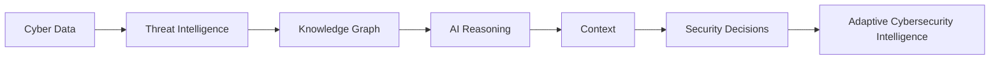

  

<h1 align="center">OrchiCyb</h1>

Independent Cybersecurity Research Lab

Exploring Adaptive Cybersecurity Intelligence, CTI, AI Security and Digital Risk.

---

## Research Vision

Most cybersecurity platforms focus on collecting more data.

OrchiCyb explores a different question:

> **How can intelligence become adaptive rather than simply reactive?**

The lab investigates how artificial intelligence, knowledge graphs and contextual reasoning can transform cyber data into meaningful security decisions.

Rather than building another monitoring platform, the goal is to explore how cybersecurity systems can continuously learn, connect relationships and adapt to evolving threats.

  

---

## Research Areas

- Adaptive Cybersecurity Intelligence
- Cyber Threat Intelligence
- AI Security
- Knowledge Graphs
- Detection Engineering
- Threat Hunting
- Digital Risk
- Governance Context
- Adversarial AI
- MITRE ATT&CK
- MITRE D3FEND
- MITRE ATLAS

---

## Research Workflow

---

## Featured Research

### 🌸 OrchiCyb AI ATTACK

An AI-native Adaptive Cybersecurity Intelligence platform exploring the relationships between:

- Threat Actors
- Campaigns
- MITRE ATT&CK
- MITRE D3FEND
- MITRE ATLAS
- Security Controls
- Governance Context
- Detection Engineering
- AI-assisted Intelligence

➡️ https://github.com/orchicyb/OrchiCyb-AI-Attack

---

## Current Focus

- Building AI-assisted cybersecurity research tools
- Exploring adaptive intelligence models
- Knowledge graph reasoning
- Human-AI collaboration in cybersecurity
- Emerging AI threats and adversarial techniques

---

## Research Philosophy

Cybersecurity becomes valuable when it improves decisions.

Threat intelligence becomes meaningful when relationships become visible.

Artificial intelligence becomes useful when it provides context rather than noise.

Adaptive Cybersecurity Intelligence is the intersection of these ideas.

---

## Connect

🌐 LinkedIn  
https://linkedin.com/company/orchicyb

🌐 Instagram  
https://instagram.com/orchicyb

---
